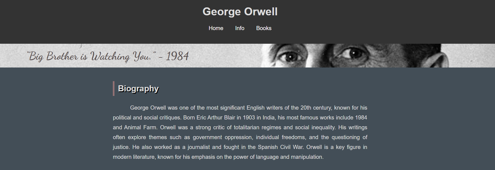
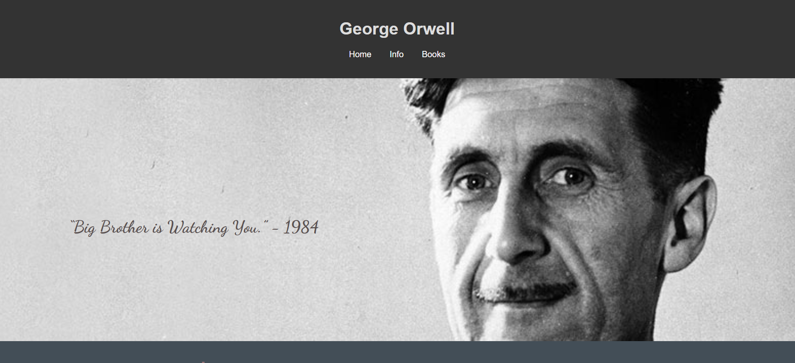
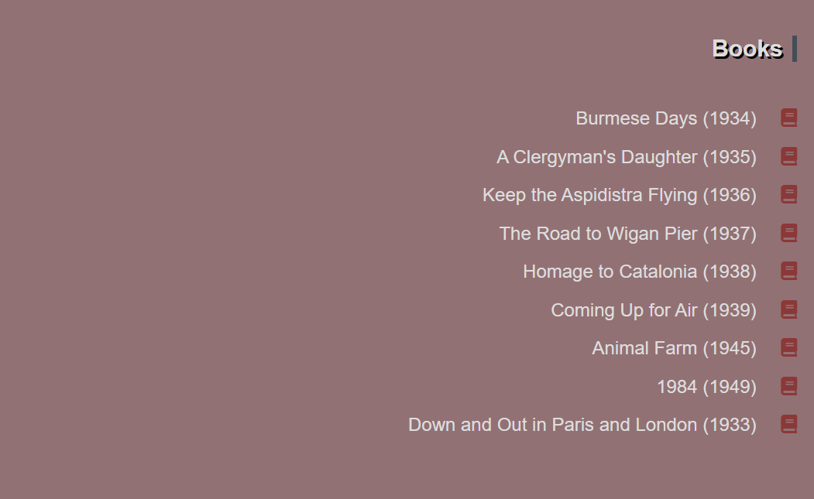
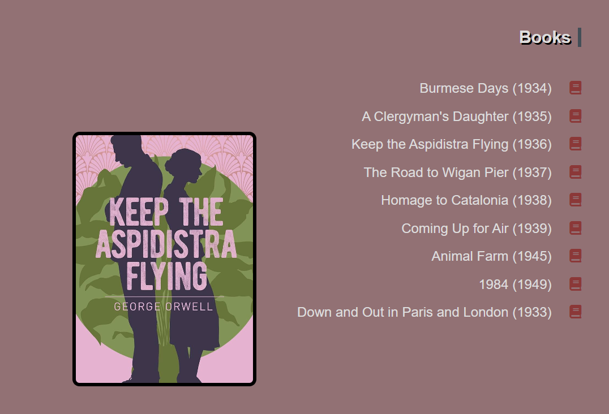
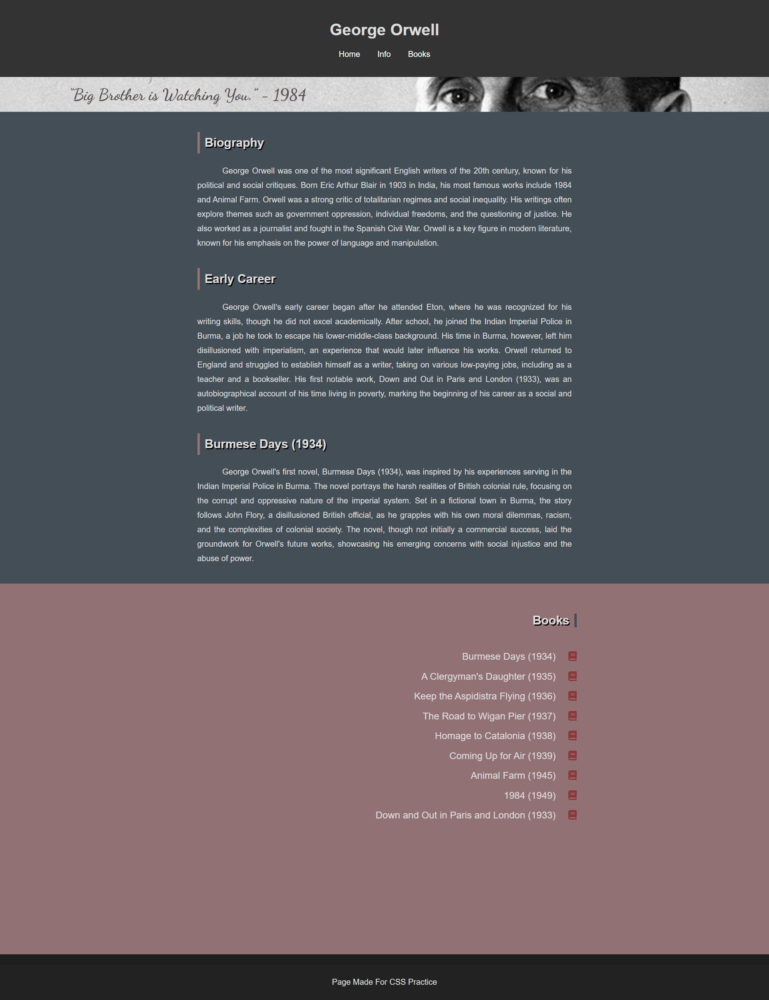
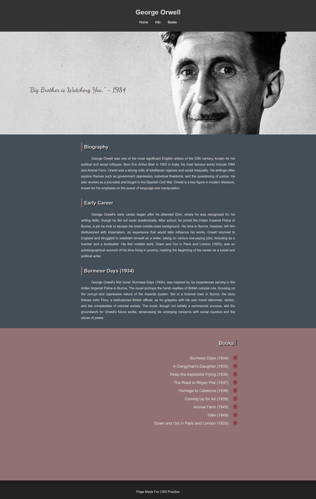

# :closed_book: Tribute Website | George Orwell

[🇹🇷 Click for Turkish README.md](./README.tr.md)

*Created on: February 13, 2025*

* This project is created for Patika Frontend Bootcamp as **Week-2 / Assignment-2 | Tribute Website** project.
* A tribute website developed using **HTML** and **CSS** to honor George Orwell's life and works.
* Semantic HTML tags and modern web design principles are used.

---

## 🌐 Live Demo

Visit the live website: [Tribute Website | George Orwell](https://tribute-website-george-orwell.vercel.app)

---

## :computer: Usage

1. Clone the repository
```bash
git clone https://github.com/tunahanyasar/tribute-website-george-orwell.git
```

2. Navigate to the project directory
```bash
cd tribute-website-george-orwell
```

3. Open `index.html` in a web browser
   - By double-clicking the file
   - Or using a local server (e.g., VS Code Live Server extension)

---

## 📜 Project Content

### 1. Page Structure
- Created a single-page tribute website with multiple sections
  - Used **Semantic Tags** throughout for better structure
  - Implemented consistent styling across all sections

### 2. Main Features
- **Header** section with title and navigation
  - Biography section with key life events
  - Literary works showcase
  - Famous quotes section
- **Footer** with additional resources and references

### 3. Content Organization
- Chronological timeline of Orwell's life
- List of major literary works with descriptions
- Collection of notable quotes
- Impact on literature and society
- Historical context and significance

### 4. Design Elements
- Clean and readable typography
- Responsive layout using **Flexbox**
- Historical photographs and book covers
- Color scheme reflecting Orwell's era
- Modern and accessible design approach

### 5. Interactive Features
1. **Author's Quote Display**
   - Quote appears aligned with the author's eyes
   - Quote and author's image are initially shown with a thin line
   - CSS hover effect reveals the full content:
   
   
   *Image 1: Initial State*
   
   
   *Image 2: Hover State*

2. **Book List Interaction**
   - Book cover images are hidden initially
   - CSS hover effect reveals book covers when hovering over list items:
   
   
   *Image 1: Initial State*
   
   
   *Image 2: Hover State*

### 6. Page Structure Details
- **index.html**: Homepage designed as a one-page website
  1. **Header** with **nav** for internal navigation to home, info, and book sections
  2. Content divided into 3 **Sections**:
     1. First **Section**: Author's visual content and citation introduction
     2. Second **Section**: Author's biography
     3. Third **Section**: Author's works
  3. **Footer**
- **style.css**: Contains all CSS properties for index.html
- **img**: Directory containing author and book cover images

---

## 💡 Technologies Used

**HTML:**
* Semantic Tags
* Meta Tags
* Navigation Structure
* Article Elements
* Image Integration

**CSS:**
* Flexbox Layout
* Responsive Design
* Custom Properties
* Style Attributes
* Media Queries
* Pseudo-classes (hover effects)

---

## 📸 Page Output




---

## 🎯 Project Goals

1. **User Experience**
   - Easy navigation through content
   - Clear information hierarchy
   - Responsive design for all devices

2. **Content Organization**
   - Well-structured biographical information
   - Logical content flow
   - Easy access to key information

3. **Technical Achievements**
   - Semantic HTML implementation
   - Modern CSS techniques
   - Responsive and accessible design

---

## 📞 Contact

[Tunahan Yaşar](https://github.com/tunahanyasar)

* GitHub: [@tunahanyasar](https://github.com/tunahanyasar)
* LinkedIn: [Tunahan Yaşar](https://www.linkedin.com/in/tunahan-yasar/)


