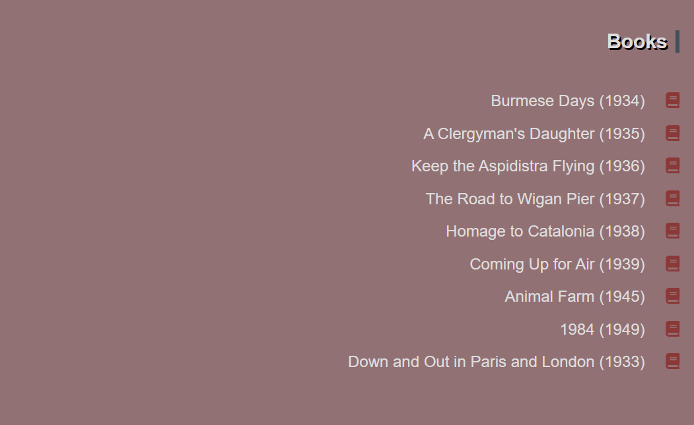
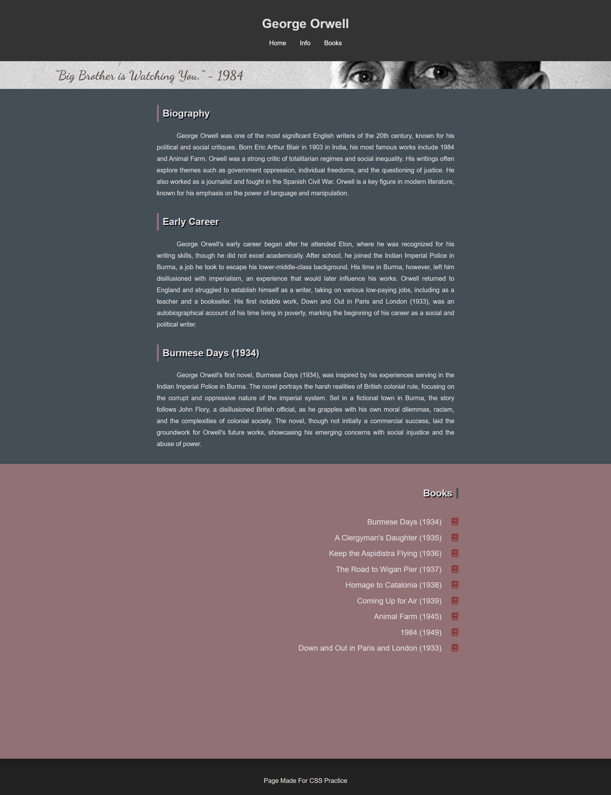

# :closed_book: Tribute Website | George Orwell

[🇬🇧 İngilizce README.md için tıklayın](./README.md)

*Oluşturulma Tarihi: 13 Şubat 2025*

* Bu proje, Patika Frontend Bootcamp için **Hafta-2 / Ödev-2 | Tribute Website** projesi olarak oluşturulmuştur.
* George Orwell'in hayatını ve eserlerini anmak için **HTML** ve **CSS** kullanılarak geliştirilmiş bir tribute websitesidir.
* Semantic HTML etiketleri ve modern web tasarım prensipleri kullanılmıştır.

---

## 🌐 Canlı Demo

Canlı siteyi ziyaret edin: [Tribute Website | George Orwell](https://tribute-website-george-orwell.vercel.app)

---

## :computer: Kullanım

1. Projeyi klonlayın
```bash
git clone https://github.com/tunahanyasar/tribute-website-george-orwell.git
```

2. Proje dizinine gidin
```bash
cd tribute-website-george-orwell
```

3. `index.html` dosyasını bir web tarayıcısında açın
   - Dosyaya çift tıklayarak
   - Veya yerel bir sunucu kullanarak (örn. VS Code Live Server eklentisi)

---

## 📜 Proje İçeriği

### 1. Sayfa Yapısı
- Birden fazla bölümden oluşan tek sayfalık bir tribute websitesi
  - Daha iyi yapı için **Semantic Etiketler** kullanıldı
  - Tüm bölümlerde tutarlı stil uygulandı

### 2. Ana Özellikler
- Başlık ve navigasyon içeren **Header** bölümü
  - Önemli yaşam olaylarıyla biyografi bölümü
  - Edebi eserler vitrini
  - Ünlü alıntılar bölümü
- Ek kaynaklar ve referanslar içeren **Footer**

### 3. İçerik Organizasyonu
- Orwell'in hayatının kronolojik zaman çizelgesi
- Açıklamalı başlıca edebi eserlerin listesi
- Önemli alıntılar koleksiyonu
- Edebiyat ve toplum üzerindeki etkisi
- Tarihsel bağlam ve önemi

### 4. Tasarım Öğeleri
- Temiz ve okunabilir tipografi
- **Flexbox** kullanılarak responsive tasarım
- Tarihi fotoğraflar ve kitap kapakları
- Orwell'in dönemini yansıtan renk şeması
- Modern ve erişilebilir tasarım yaklaşımı

### 5. İnteraktif Özellikler
1. **Yazar Alıntısı Gösterimi**
   - Alıntı yazarın gözleri hizasında görünür
   - Alıntı ve yazarın resmi başlangıçta ince bir çizgi halinde gösterilir
   - CSS hover efekti ile tam içerik ortaya çıkar:
   
   
   *Görsel 1: Başlangıç Durumu*
   
   
   *Görsel 2: Hover Durumu*

2. **Kitap Listesi Etkileşimi**
   - Kitap kapakları başlangıçta gizlidir
   - Liste öğelerinin üzerine gelindiğinde CSS hover efekti ile kitap kapakları görünür:
   
   
   *Görsel 1: Başlangıç Durumu*
   
   
   *Görsel 2: Hover Durumu*

### 6. Sayfa Yapısı Detayları
- **index.html**: Ana sayfa, tek sayfalık bir web sitesi olarak tasarlanmıştır
  1. **Header** bölümünde, ana sayfa, bilgi ve kitap bölümlerine dahili gezinme için **nav** bulunur
  2. İçerik 3 **Bölüme** ayrılmıştır:
     1. Birinci **Bölüm**: Yazarın görsel içeriği ve alıntı tanıtımı
     2. İkinci **Bölüm**: Yazarın biyografisi
     3. Üçüncü **Bölüm**: Yazarın eserleri
  3. **Footer**
- **style.css**: index.html için tüm CSS özelliklerini içerir
- **img**: Yazar ve kitap kapak görsellerini içeren dizin

---

## 💡 Kullanılan Teknolojiler

**HTML:**
* Semantic Etiketler
* Meta Etiketler
* Navigasyon Yapısı
* Article Elementleri
* Görsel Entegrasyonu

**CSS:**
* Flexbox Düzeni
* Responsive Tasarım
* Özel Özellikler
* Stil Özellikleri
* Medya Sorguları
* Pseudo-sınıflar (hover efektleri)

---

## 📸 Sayfa Çıktısı

### Önce


### Sonra


---

## 🎯 Proje Hedefleri

1. **Kullanıcı Deneyimi**
   - İçerikte kolay gezinme
   - Net bilgi hiyerarşisi
   - Tüm cihazlar için responsive tasarım

2. **İçerik Organizasyonu**
   - İyi yapılandırılmış biyografik bilgiler
   - Mantıksal içerik akışı
   - Önemli bilgilere kolay erişim

3. **Teknik Başarılar**
   - Semantic HTML uygulaması
   - Modern CSS teknikleri
   - Responsive ve erişilebilir tasarım

---

## 📞 İletişim

[Tunahan Yaşar](https://github.com/tunahanyasar)

* GitHub: [@tunahanyasar](https://github.com/tunahanyasar)
* LinkedIn: [Tunahan Yaşar](https://www.linkedin.com/in/tunahan-yasar/) 
